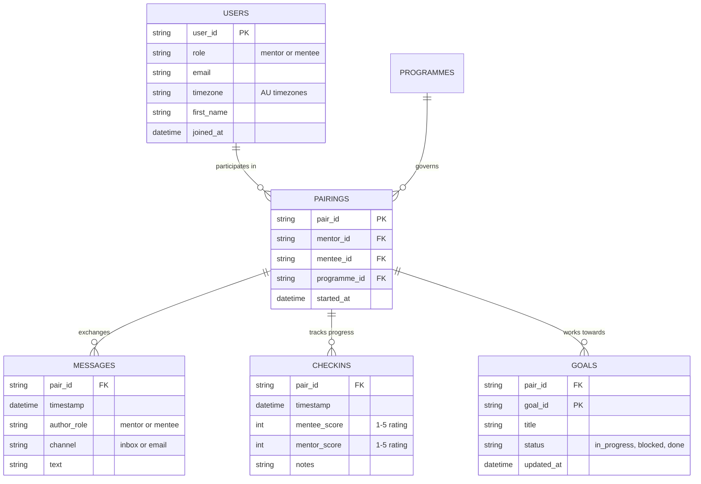

# Agentic MentorLoop Demo

A minimal agent loop demonstration using MentorLoop-flavoured data, showcasing how to build AI agents that understand mentorship contexts.

## Overview

This demo implements a basic "Agent Loop" pattern - **think → decide → act → reflect** - using realistic MentorLoop scenarios and data. It's designed to show you how agents work at their core, without the complexity of production frameworks.

**What's included:**
- Fake datasets modelled on MentorLoop data (users, pairings, check-ins, messages, tips)
- Two identical implementations: TypeScript and Python sharing the same data
- Three provider options: offline deterministic, OpenAI, or Ollama
- Domain-specific tools that understand mentorship engagement

**Note:** Both TypeScript and Python examples share a common `examples/data/` directory to avoid duplication and ensure consistency

**Why this matters:** Understanding agent loops helps you build more sophisticated AI features, from automated nudges to intelligent coaching assistants.

## Data Structure

The demo uses fake datasets that mirror MentorLoop's domain model. All data lives in `examples/data/`:

```
examples/
├── data/                         # Shared datasets
│   ├── users.csv                # 20 users (mentors & mentees)
│   ├── pairings.csv             # 10 mentor-mentee relationships
│   ├── messages.csv             # 200 communication records
│   ├── checkins.csv             # 60 check-in events
│   ├── goals.csv                # 30 mentorship goals
│   ├── programmes.json          # 3 programme configurations
│   └── tips.json                # 12 mentorship tips
├── agentic-mentorloop-ts/       # TypeScript implementation
└── agentic-mentorloop-py/       # Python implementation
```

### Entity Relationships



### Dataset Details

#### `users.csv`
Contains 20 users split between mentors and mentees across Australian timezones. Each user has:

- Unique ID (e.g., `u001`)
- Role designation (`mentor` or `mentee`)
- Professional email address
- Australian timezone (Sydney, Melbourne, Brisbane, Perth, etc.)
- First name for personalisation
- Join date for tenure calculations

#### `pairings.csv`
Maps 10 active mentor-mentee relationships, linking:

- Unique pair ID (e.g., `p001`)
- Mentor's user ID
- Mentee's user ID
- Programme they're enrolled in
- Start date of the mentorship

#### `messages.csv`
200 communication records showing realistic mentorship conversations:

- Pair ID to identify the relationship
- Timestamp of the message
- Author's role (mentor or mentee)
- Channel used (`inbox` for in-app, `email` for external)
- Message text (supportive, questioning, celebrating wins)

The balance of messages helps identify one-sided conversations - a key engagement metric.

#### `checkins.csv`
60 check-in events with varied recency to create dormant scenarios:

- Pair ID for the relationship
- Timestamp (deliberately aged to create dormant pairs)
- Mentee's self-assessment score (1-5)
- Mentor's assessment score (1-5)
- Notes about progress

Some pairs have check-ins >14 days old, making them "dormant" in the system's logic.

#### `goals.csv`
30 mentorship goals across different pairs showing:

- Pair ID owning the goal
- Unique goal ID
- Goal title (e.g., "Complete leadership course")
- Current status: `in_progress`, `blocked`, or `done`
- Last update timestamp

Blocked goals are opportunities for intervention.

#### `programmes.json`
3 programme configurations that define mentorship cadence:

```json
{
  "programme_id": "prog001",
  "name": "Leadership Excellence Programme",
  "cadence_days": 7,  // Expected check-in frequency
  "success_markers": ["regular_checkins", "goal_progress"]
}
```

The `cadence_days` determines when to nudge for check-ins.

#### `tips.json`
12 mentorship tips tagged by situation:
```json
{
  "tip_id": "t4",
  "situation": "one_sided",
  "text": "Balance one-sided conversations by asking open-ended questions..."
}
```

Situations include: `dormant`, `one_sided`, `celebrate_wins`, `blocked_goal`. The RAG system matches these to user queries.

### How Tools Use This Data

1. **`engagement_pulse`** reads `checkins.csv` and `messages.csv` to:
   - Count dormant pairs (last check-in >14 days)
   - Analyse message balance (mentor-heavy, mentee-heavy, balanced)
   - Find the oldest check-in across all pairs

2. **`mentor_tips`** searches `tips.json` using:
   - Text similarity between query and tip content
   - Situation tags for better matching
   - Returns top 2 most relevant tips with scores

3. **`compose_nudge`** combines multiple sources:
   - Reads `users.csv` for personalisation (names)
   - Uses `programmes.json` for cadence expectations
   - Incorporates tips and engagement data
   - Generates contextual nudge messages

## Setup

### TypeScript Version

```bash
cd examples/agentic-mentorloop-ts
npm install
cp .env.example .env
```

### Python Version

```bash
cd examples/agentic-mentorloop-py
python -m venv .venv
source .venv/bin/activate  # Windows: .venv\Scripts\activate
pip install -r requirements.txt
cp .env.example .env
```

## Providers

Configure your `.env` file based on which provider you want to use:

### Deterministic (Offline)
```env
# No configuration needed - works out of the box
PROVIDER=deterministic
```

### OpenAI
```env
PROVIDER=openai
MODEL=gpt-4o-mini
OPENAI_API_KEY=sk-your-key-here
```

### Ollama (Local LLM)
```env
PROVIDER=ollama
MODEL=llama3.1:8b
OLLAMA_HOST=http://localhost:11434
```

First pull your model: `ollama pull llama3.1:8b` (or maybe `ollama pull phi4:latest`)

## Examples

Each example demonstrates a different aspect of the agent loop and how it applies to MentorLoop scenarios.

### Hello Agent Loop

**What it shows:** The bare minimum agent cycle - how an agent thinks about your request, decides what to do, takes action and reflects on the result.

```bash
# TypeScript
npx ts-node src/cli.ts --prompt "echo hello mentorloop"

# Python
python -m agentic_mentorloop --prompt "echo hello mentorloop"
```

**Output:**
```json
{
  "thought": "Processing: \"echo hello mentorloop\"",
  "action": "USE:echo",
  "observation": "Echo: hello mentorloop",
  "reflection": "looks ok"
}
```

**Learn:** This is the fundamental pattern - every agent interaction follows this loop, whether simple or complex.


> We've built the simplest agent we can — it just echoes back. 
> What's important here is not the echo, but that we can see the full 
> loop cycle working. This is the foundation we'll keep layering onto, 
> with tools, datasets and eventually an LLM.

### Engagement Pulse Summary

**What it shows:** A domain-specific tool that understands MentorLoop data, analysing check-ins and messages to spot engagement patterns.

```bash
# TypeScript
npx ts-node src/cli.ts --prompt "check engagement pulse"

# Python
python -m agentic_mentorloop --prompt "check engagement pulse"
```

**Output:**
```json
{
  "observation": {
    "type": "summary",
    "sample": 10,
    "dormant": 3,
    "balance": "balanced",
    "last_checkin_days": 27
  }
}
```

**Learn:** Agents become valuable when they understand your domain. This tool knows what "dormant" means in a mentorship context (>14 days since check-in).

### Engagement Pulse List

**What it shows:** The same tool adapting its behaviour based on how you ask - returning specific mentees instead of a summary when you say "which" or "who".

```bash
# TypeScript
npx ts-node src/cli.ts --prompt "which mentees look dormant" --limit 3

# Python
python -m agentic_mentorloop --prompt "which mentees look dormant" --limit 3
```

**Output:**
```json
{
  "observation": {
    "type": "list",
    "dormant_count": 3,
    "mentees": [
      {
        "mentee_id": "u004",
        "first_name": "Emily",
        "pair_id": "p002",
        "last_checkin_days": 27
      }
    ]
  }
}
```

**Learn:** Smart tools are input-aware - they understand intent from natural language and adjust their response format accordingly.

### Mentor Tips (RAG)

**What it shows:** A tiny retrieval system that finds relevant mentorship advice from a knowledge base, using simple text similarity (no embeddings API needed).

```bash
# TypeScript
npx ts-node src/cli.ts --prompt "tips for one sided conversations" --json-only

# Python
python -m agentic_mentorloop --prompt "tips for one sided conversations" --json-only
```

**Output:**
```json
{
  "type": "tips",
  "hits": [
    {
      "id": "t4",
      "score": 0.41,
      "text": "Balance one-sided conversations by asking open-ended questions that encourage the quieter party to share their perspective",
      "tags": ["one_sided", "engagement"]
    }
  ]
}
```

**Learn:** RAG (Retrieval-Augmented Generation) doesn't require complex infrastructure - even basic text matching can provide contextual knowledge to agents.

### Tips → Nudge Chain

**What it shows:** How agents create value by chaining tools together - taking tips and engagement data to compose a personalised nudge message.

```bash
# TypeScript
npx ts-node src/cli.ts --prompt "tips for dormant mentees" --compose --json-only

# Python
python -m agentic_mentorloop --prompt "tips for dormant mentees" --compose --json-only
```

**Output:**
```json
{
  "tips": {
    "type": "tips",
    "hits": [...]
  },
  "nudge": {
    "type": "nudge",
    "subject": "Checking in on your Leadership Excellence Programme progress",
    "body": "Hi Emily, noticed it has been 27 days since your last check-in..."
  }
}
```

**Learn:** The real power of agents comes from orchestrating multiple capabilities - here we retrieve knowledge, analyse engagement and generate personalised communication in one flow.

## Options

### Command-line Flags

- `--prompt <text>` - What you're asking the agent to do
- `--limit <n>` - Max items for list results (default: 5)
- `--json-only` - Output only the observation JSON (great for demos)
- `--compose` - Chain tips into a nudge composition
- `--debug` - Show provider and model info
- `--provider` - Override provider from .env
- `--model` - Override model from .env

### Examples with Options

```bash
# Get top 3 dormant mentees as clean JSON
npx ts-node src/cli.ts --prompt "which mentees are dormant" --limit 3 --json-only

# Use OpenAI instead of deterministic
npx ts-node src/cli.ts --prompt "tips for blocked goals" --provider openai --model gpt-4o-mini

# Debug what provider is being used
npx ts-node src/cli.ts --prompt "engagement pulse" --debug
```

## Outputs

All commands return JSON with the agent loop structure:

```json
{
  "thought": "What the agent is thinking about your request",
  "action": "The tool or response it chose",
  "observation": "What it observed from the action",
  "reflection": "Self-assessment: 'looks ok' or 'needs improvement'"
}
```

### Observation Types

Each tool returns structured observations with a `type` field:

- **`summary`** - Aggregated metrics (engagement pulse rollup)
- **`list`** - Specific items (dormant mentees with details)
- **`tips`** - Retrieved knowledge (mentorship advice)
- **`nudge`** - Generated content (personalised message)
- **`error`** - Something went wrong (with hints)

## What This Demo Shows Overall

This minimal implementation demonstrates several key concepts:

1. **Agent Loops are Simple** - At their core, agents just think, decide, act and reflect. The complexity comes from the tools and orchestration

2. **Domain Tools Matter** - Generic agents become valuable when equipped with tools that understand your specific domain (mentorship engagement, check-in patterns)

3. **Providers are Swappable** - The same agent logic works with deterministic rules, OpenAI's GPT, or local Ollama models. This abstraction lets you optimise for cost, speed, or capability

4. **Chaining Creates Value** - Individual tools are useful, but chaining them together (tips → nudge) creates workflows that deliver real value to users

5. **Start Small, Iterate** - You don't need LangChain or complex frameworks to build useful agents. Start with simple tools and clear interfaces

## Next Steps

After exploring these examples, consider:

- Adding a new tool that analyses goal progress from `goals.csv`
- Implementing a tool that suggests optimal check-in times based on timezone data
- Creating a reflection tool that summarises a mentorship journey
- Building a matching tool that suggests mentor-mentee pairings based on compatibility

The patterns you learn here - agent loops, tool design, provider abstraction - scale up to production AI features that can transform how MentorLoop delivers value to mentors and mentees.